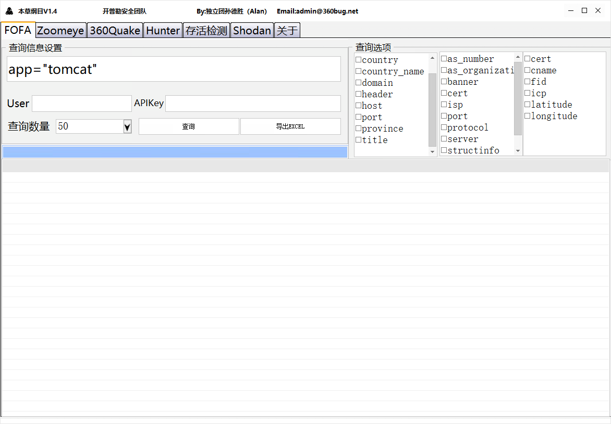

# 本草纲目V1.4版本

**使用、利用软件信息而造成的任何或直接的此后果及损失，均由用户本人承担责任，软件制作者不承担任何责任。**

**开普勒安全团队有此软件的修改和解释权，如欲转载或传播此软件，必须包括版权声明、法律声明、免责声明等全部内容。**

## 法律声明：

```
1.依据《刑法修正案（七）》第9条增订的《刑法》第285条第3款的规定，犯提供非法侵入或者控制计算机信息系罪的，处3年以下有期徒刑或者拘役，并处或者单处罚金；情节特别严重的，处3年以上7年以下有期徒刑，并处罚金。
2.第二百八十五条第二款 违反国家规定，侵入前款规定以外的计算机信息系统或者采用其他技术手段，获取该计算机信息系统中存储、处理或者传输的数据，或者对该计算机信息系统实施非法控制，情节严重的，处三年以下有期徒刑或者拘役，并处或者单处罚金；情节特别严重的，处三年以上七年以下有期徒刑，并处罚金。
3.刑法第二百五十三条之一：“国家机关或者金融、电信、交通、教育、医疗等单位的工作人员，违反国家规定，将本单位在履行职责或者提供服务过程中获得的公民个人信息，出售或者非法提供给他人，情节严重的，处三年以下有期徒刑或者拘役，并处或者单处罚金。情节特别严重的，处三年以上七年以下有期徒刑，并处罚金。
```

## 免责声明：

##### 任何使用本软件的用户均应仔细阅读本声明，用户可选择不使用，用户使用本软件的任何行为将被视为对本声明全部内容的认可。本软件是帮助用户了解信息安全技术、安全漏洞相关信息的互联网信息服务提供帮助，仅供交流与学习，切勿用于实战(实际)环境中，

##### 本软件是集成了常见的信息收集接口,吸取目前市面上常见的工具能力,并极大可能简化使用过程。

##### 本软件所有内容并不反映任何本人之意见，如有侵权请联系邮箱admin@360bug.net进行删除。

##### 仅供网络安全从业者内部安全研究与教学之用，请勿违反您所在地区法律例如《中华人民共和国网络安全法》等。

##### 用户如将其信息做其他用途，由用户承担全部法律及连带责在，本软件不承担任何法律及连带责任。

##### 因为违反本声明的规定而触犯当地法律法规的，一切后果由使用者负责，本软件及软件制作者不承担任何法律责任。

##### 因为违反本声明的规定而触犯当地法律法规的，一切后果由使用者负责，本软件及软件制作者不承担任何法律责任。

##### 侵权以及反馈Bug 联系 admin@360bug.net

##### 感谢名单:原Alan知识星球所有现存用户,SuPejkj

##### 特别致谢：DeHby

### 软件界面：



### 配置文件：

```
[zoom]
key=
[FOFA]
user=
pass=
[360]
token=
[hunter]
key=
```

## 安全声明：

#### 如不放心使用本软件，个人建议可以放在虚拟机里使用！

#### 有任何Bug可反馈至邮箱  admin@360bug.net


### 一点碎碎念：

```
2022年3月16日凌晨，修复V1.3版本中无法查询中文的问题,但是zoomeye的主机设备搜索、Web应用搜索 的官方接口坏了,不知道官方是不是在更新接口方式,如果更新的话我会在第一时间推出V1.5版本,如果只是常规维护那就不需要更新了。
```

